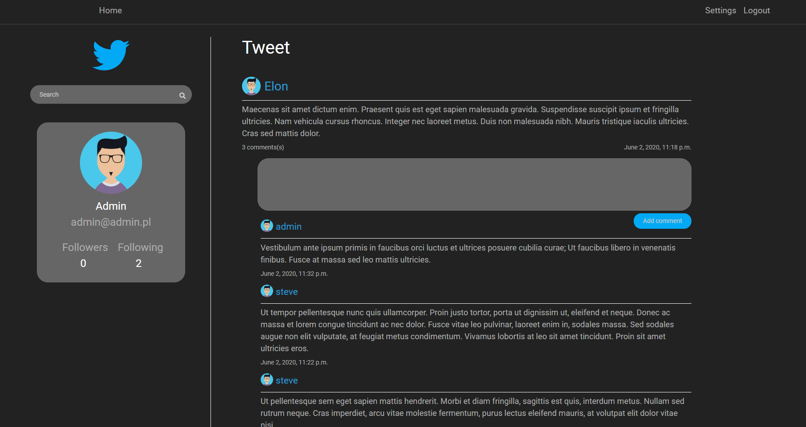
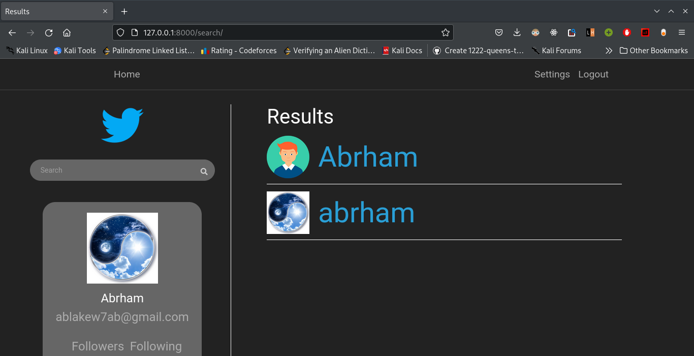
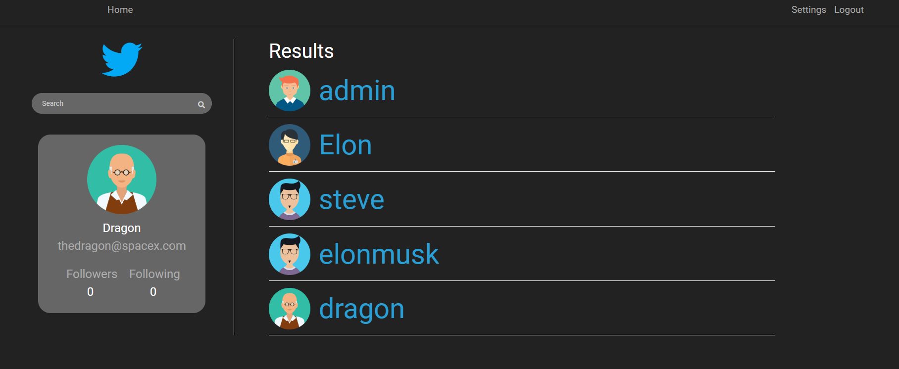
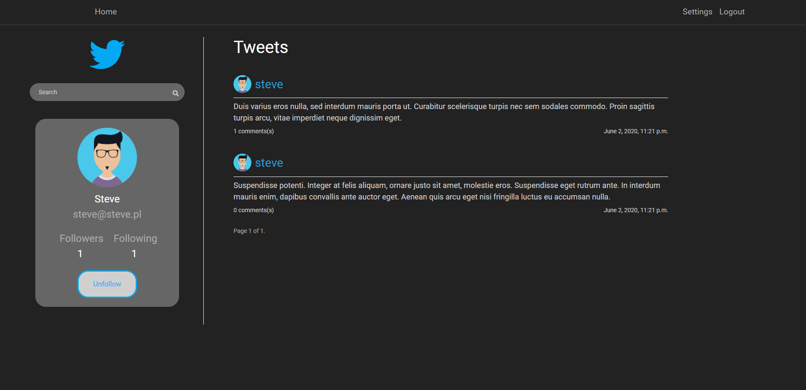
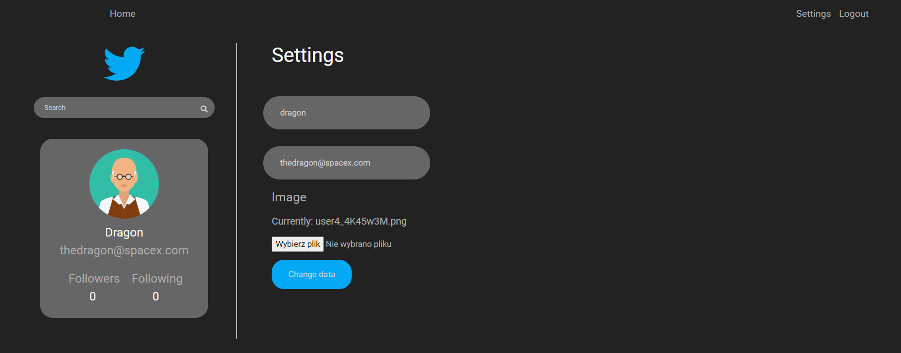
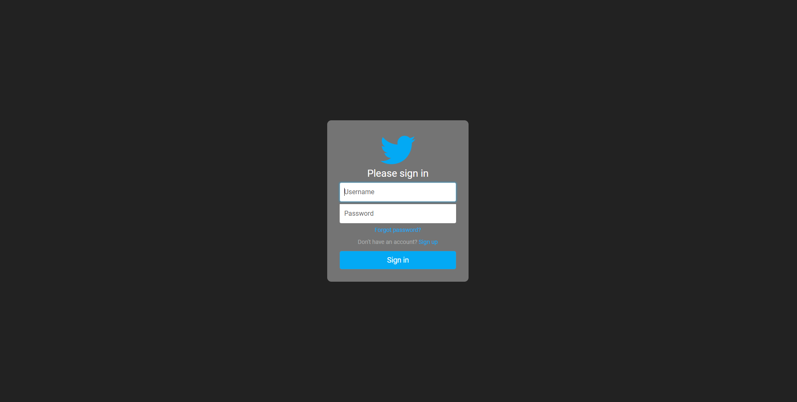
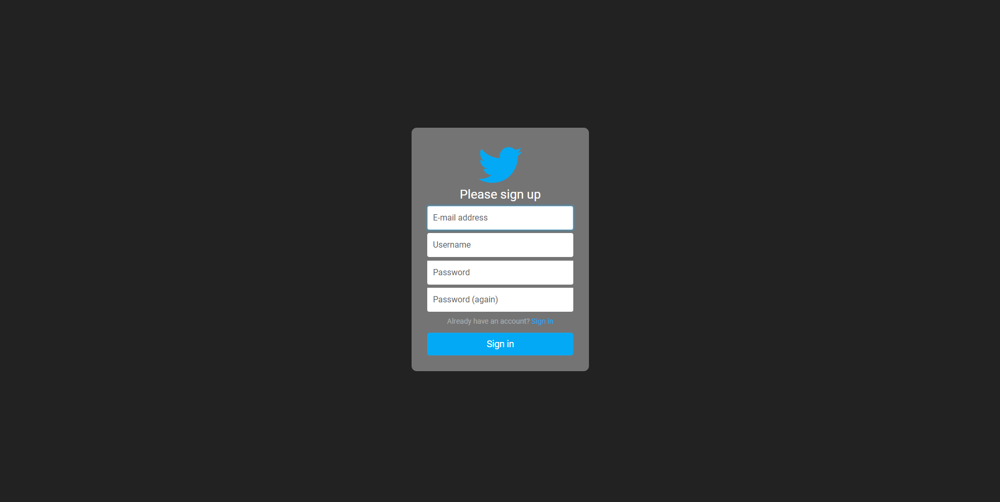

<<<<<<< HEAD
# twitter_clone
=======
# Twitter clone

### Fully functional Django website that works exactly like real Twitter 

##### Home page
   
##### Tweet page
  
##### Search results page
  
##### Search results page
  
##### User's page
  
##### User's settings page
  
##### Sign in page
  
##### Sign up page
  
 
### TODO
- [ ] Add mobile friendly template
- [ ] Like functionality
- [ ] 'Update and delete tweets by user' functionality

>>>>>>> master
