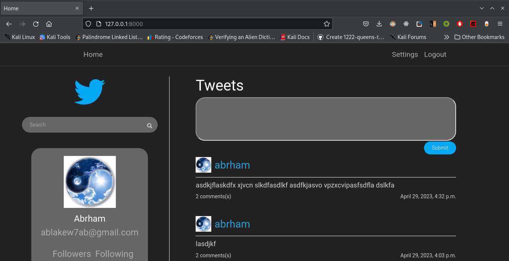
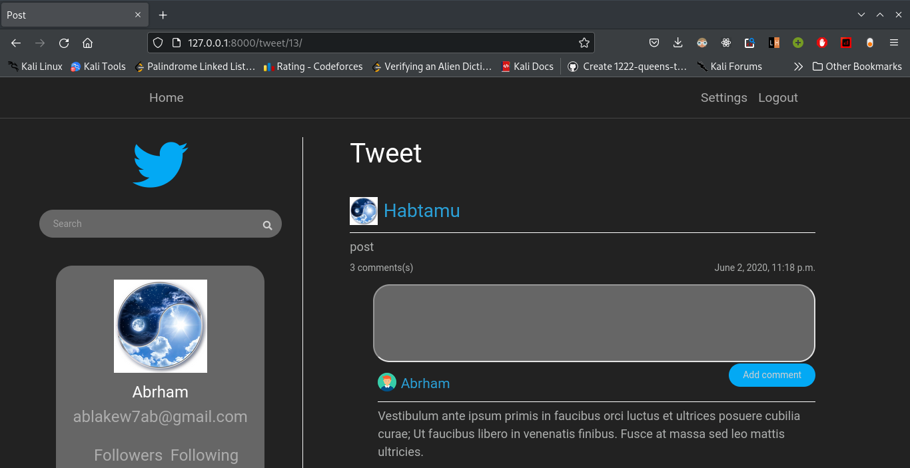
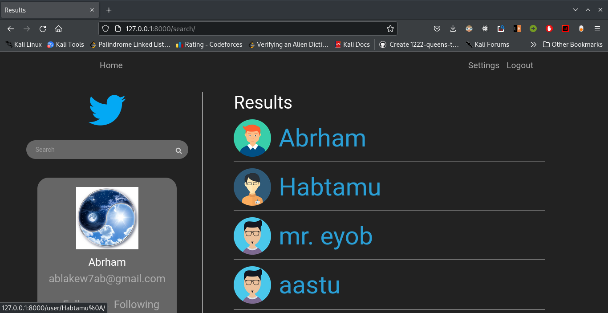
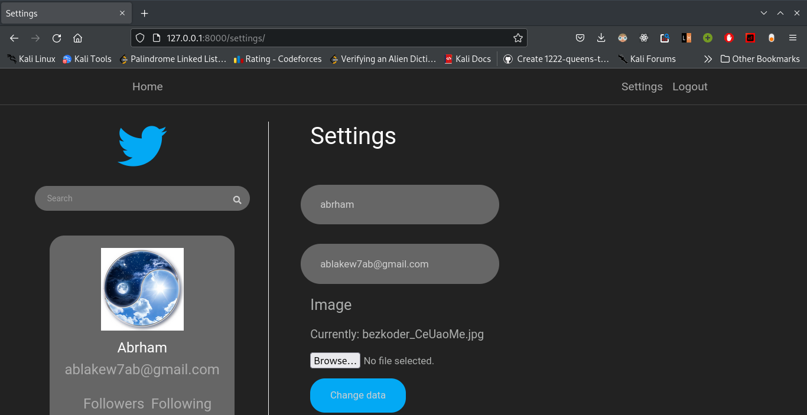

<<<<<<< HEAD
# twitter_clone
=======
# Twitter clone

### Advanced Programming Python web framework (Django) Project 

##### Home page
   

##### Tweet page
  
##### Search results page
  
##### Search results page
  
##### User's page
  
##### User's settings page
  
##### Sign in page
  
##### Sign up page
  
 
>>>>>>> master
